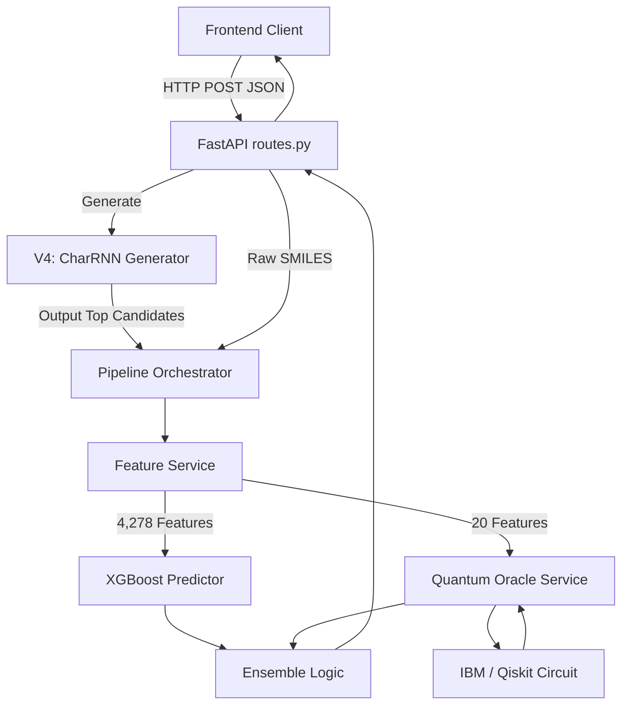
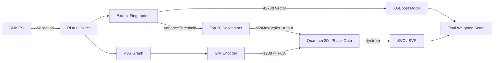
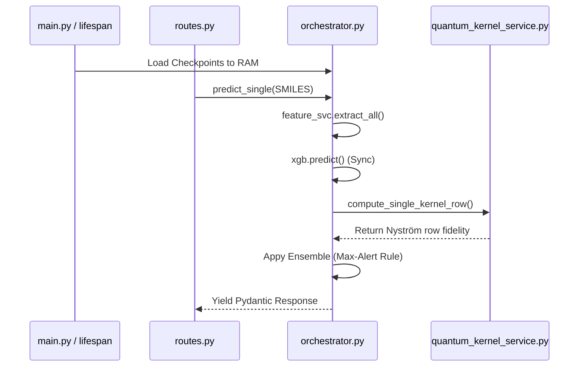
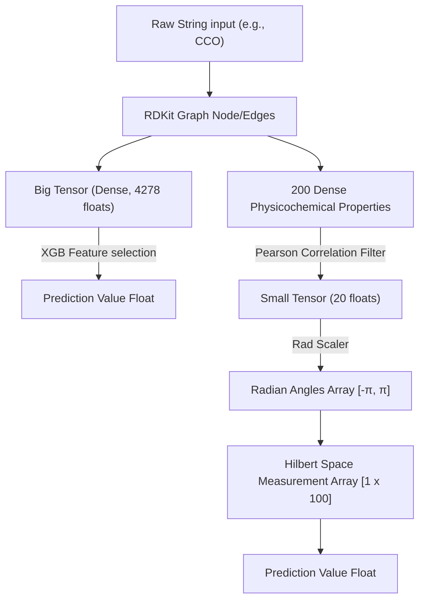

# Q-PharmX: Deep Internal System Pipeline
*End-to-End Technical & Mathematical Working Documentation*

---

## 1. 🧬 End-to-End System Flow (High-Level)

The Q-PharmX system is an advanced hybrid pipeline consisting of classical predictive algorithms (XGBoost, GNN), generative deep learning (CharRNN with Reinforcement Learning), and strict quantum physics simulations (QSVM/QSVR) designed to operate in the Noisy Intermediate-Scale Quantum (NISQ) era.

1. **Input Generation / Retrieval:** The system begins either by receiving a user-provided SMILES string (a 1D chemical text representation) or by dynamically forging one using a conditional Recurrent Neural Network based on a 3D target protein PDB pocket.
2. **Deterministic Validation & Feature Engineering:** The raw SMILES is aggressively parsed by RDKit to ensure chemical validity, canonicalized to prevent duplicates, and mathematical topological features are extracted (ranging from standard 2D molecular weight to complex MACCS and Morgan fingerprints).
3. **Classical Filtration (The Router):** A hyper-optimized XGBoost model acts as the first gatekeeper, parsing thousands of dimensional vectors in milliseconds to predict baseline toxicity and binding affinity.
4. **Quantum Evaluation (The Oracle):** Due to qubit constraints (20 qubits on IBM Heron r2), the 4,278 classical features are mathematically compressed into 20 orthogonal features via Pearson Correlation variance filters. These 20 dimensions are mapped into a Hardware-Efficient Ansatz (HEA). The quantum computer measures the theoretical multi-dimensional overlap (fidelity) between the target drug and pre-calculated landmarks perfectly to rescue compounds classical ML usually misclassifies.
5. **Ensemble Finalization:** The system weighs the classical statistical guess against the quantum mechanical measurement to return a heavily calibrated probabilistic JSON response via FastAPI to the user interface.

---

## 2. 🔄 Detailed Step-by-Step Internal Workflow

### Stage 1: Input Handling (The API Boundary)
- **Receiving Input:** The `FastAPI` router (`routes.py`) accepts HTTP requests containing the raw string (e.g., `O=C(C)Oc1ccccc1C(=O)O`). 
- **Validation:** RDKit's `Chem.MolFromSmiles()` attempts to construct a graph object. If it fails, the system immediately returns a 422 error or assigns a heavy $-1.0$ RL penalty.
- **Preprocessing:** Valid molecules are immediately canonicalized (`Chem.MolToSmiles(mol, canonical=True)`) to ensure downstream caches are never duplicated.

### Stage 2: Molecular Representation (Chemistry to Tensors)
- The canonical string is digested by `FeatureService`.
- **String to Graph:** For Graph Neural Networks (GIN), PyTorch Geometric transforms the string into an edge-index map where nodes are atoms and edges are chemical bonds (single/double/aromatic).
- **String to Fingerprints:** RDKit generates MACCS Keys (167-bit structurally deterministic keys) and Morgan Fingerprints (Radius 2 and 3; mapping circular environments around atoms), returning flat integer arrays.

### Stage 3: Feature Extraction
The unified fingerprint concatenates exactly **4,278 features**:
- **Molecule Weight & LogP:** Core predictors for whether a drug is too heavy or too fatty (Lipinski rules).
- **H-Bond Donors/Acceptors:** Determines if the molecule can chemically fuse with the disease protein.
- **Topological Descriptors:** Values that define the physical "spread" and molecular surface area.
*Why they matter:* Classical models cannot "see" 3D reality, so they rely on these 4,278 scalar proxies to guess how the drug behaves.

### Stage 4: Model Pipeline

**1. The CharRNN Generator (V4)**
- *Type:* Recurrent LSTM.
- *Input:* 7D pocket vector (PDB geometric constraints).
- *Output:* Autoregressively generated characters forming SMILES.
- *Why:* Used to invent completely new drugs on the fly when existing databases lack valid compounds.

**2. The XGBoost Configured Router (V2/V3)**
- *Type:* Gradient Boosted Decision Tree (Classifier/Regressor).
- *Input:* 4,278-d unified fingerprint.
- *Output:* Baseline $[0,1]$ Toxicity probability or $[2,12]$ Binding pIC50.
- *Why:* Unmatched speed ($<50$ms). It handles large batches seamlessly.

**3. Graph Isomorphism Network Encoder (GIN)**
- *Type:* Graph Neural Network operating via Message Passing.
- *Input:* PyG Data edges/nodes.
- *Output:* 128-dimensional dense representation.
- *Why:* Explicitly retains the multi-hop topological structure of the molecule that flat arrays destroy.

**4. The Quantum Kernel Oracle (QSVM/QSVR - V2/V3)**
- *Type:* Hardware-Efficient Ansatz Circuit mapped into a Scikit-Learn SVC/SVR.
- *Input:* 20 strictly orthogonal scale values bounded to $[-\pi, \pi]$.
- *Output:* Dense fidelity matrix predicting pure physical validity.
- *Why:* Quantum mechanics intrinsically solve high-dimensional inner products perfectly, destroying classical "hallucinations" and rescuing false positives/negatives.

---

## 3. 🧠 Mathematical Foundations

### The Nyström Quantum Kernel Approximation (The Core Breakthrough)
Evaluating the quantum inner product (kernel) for $N=5000$ molecules requires $O(N^2)$ computations—an impossibility on real hardware. We approximate this using $m=100$ landmarks.
The raw Nyström formula is:
$$ K_{train} \approx K_{nm} K_{mm}^{-1} K_{nm}^T $$
However, highly correlated landmarks cause $K_{mm}$ to become near-singular (condition numbers $> 1.5 \times 10^{13}$), outputting catastrophic garbage.
*The Mathematical Fix (`nystrom_engine.py`):*
1. **SVD-Truncated Pseudoinverse:** We decompose the landmark matrix: $K_{mm} = U \Sigma V^T$. Any singular value $\sigma_i < 0.10 \times \max(\sigma)$ is discarded.
2. **PSD Projection:** We calculate the eigenvalues of the reconstructed train matrix $K_{train}$. Any negative eigenvalues are driven to exactly zero: $\hat{\lambda}_i = \max(\lambda_i, 0)$.
3. **Cosine Normalization:** The final matrix is rescaled to prevent impossible measurements: $K_{ij} = \frac{K_{ij}}{\sqrt{K_{ii} \cdot K_{jj}}}$ bounded exactly to $[0, 1]$.

### REINFORCE Policy Gradient (Generative Engine)
To train the CharRNN to invent drugs, we use Reinforcement Learning. We calculate the gradient of the expected reward $J(\theta)$ over the AI weights:
$$ \nabla_\theta J(\theta) \approx \frac{1}{B} \sum_{i=1}^{B} (R_i - b) \nabla_\theta \log P_\theta (S_i | \phi) + \lambda \cdot D_{KL}(P_\theta || P_{prior}) $$
- $(R_i - b)$ is the Advantage over a baseline.
- $D_{KL}$ is the Kullback-Leibler divergence against a frozen prior model, rigorously forcing the AI not to forget the basic laws of chemistry (Catastrophic Forgetting).

### XGBoost Platt Scaling
Raw Gradient Boosting does not output true probabilities. It outputs margins. We apply Platt Scaling (a sigmoid overlay):
$$ P_{calibrated} = \frac{1}{1 + \exp(A \cdot f(x) + B)} $$
Where $f(x)$ is the XGBoost margin and $A,B$ are optimized mathematically using a hold-out test set during initialization.

---

## 4. ⚗️ Chemical Logic & Drug Discovery Insight

Every generated/analyzed drug is subjected to explicit pharmacological realities (`admet_scorer.py`, `reward_function.py`).

**The Reward Equation $R$:**
$$ R = \alpha \cdot \text{pIC50}_{norm} - \beta \cdot \text{Tox} + \gamma \cdot \text{QED} - \delta \cdot \text{SA} - \text{Penalty}_{div} $$

- **Toxicity Proxy ($\beta$):** Enforces Lipinski’s Rule of Five. A molecule must have $MW < 500$, $LogP < 5$, $HBD \leq 5$, and $HBA \leq 10$. If it fails, it is heavily penalized as it will likely be too toxic or too poorly absorbed inside the human gut.
- **SA Score ($\delta$):** Synthetic Accessibility (1-10). If an AI invents a perfect drug that has an SA Score of $9$, it is useless because humans cannot replicate the synthesis in a physical lab. The formula actively punishes scores $> 6$.
- **Tanimoto Penalty ($\text{Penalty}_{div}$):** We calculate the Morgan Fingerprint BitVector overlap: $T = \frac{c}{a + b - c}$. If generated sequences cross $T > 0.70$ similarity, they suffer a flat penalty to force the AI out of Mode Collapse (generating the same key repeatedly).

---

## 5. 🔀 Decision Flow Between Models

1. **Gate A: RDKit Validity.** If RDKit rejects a parsed SMILES, the pipeline instantly aborts.
2. **Gate B: XGBoost Filtration.** The valid SMILES sweeps the classical matrix in milliseconds. If in toxicity mode, the XGBoost outputs a probability. 
3. **Gate C: Quantum Matrix.** A select queue maps to the IBM quantum hardware simulation (aer statevector or shots). 
4. **Gate D: The Conservative Ensemble:** 
   - Weight distribution: $W_{XGB} = 0.55$, $W_{QML} = 0.45$.
   - **Safety Rule:** If *either* model predicts $> 60\%$ toxicity, the system overrides the simple average and forcibly pulls the outcome toward the maximum alert (`ensemble = max(ensemble_avg, max(xgb,qml) * 0.85)`). It prefers false positives over giving humans toxic drugs.

---

## 6. 🏗️ Backend Execution Flow

The strict programmatic flow mapping FastAPI to physical logic. 

1. `uvicorn` fires up `main.py`.
2. `@asynccontextmanager lifespan()` aggressively caches large matrices directly into RAM via `pipeline_loader.py` (loads the XGBoost `pkl`, the Nystrom $K_{mm}$ numpy arrays).
3. `POST /api/predict` routes the JSON to `predict_fast()` or `predict_full()` inside `orchestrator.py`.
4. `FeatureService` calculates fingerprints.
5. In parallel (if batching), `QuantumKernelService` maps $RY$ operations onto Quantum gates, applying alternating $CNOT$ linkages optimized perfectly for IBM's coupling maps.
6. The `predict_proba` is combined and routed back to FastApi JSON `PredictResponse`.

---

## 7. 📊 Data Flow & Transformation

1. **Input:** `"CCC"` (String).
2. **RDKit Object:** `<rdkit.Chem.rdchem.Mol object>` (Graph/C-based).
3. **Unified FP:** `np.ndarray` float64 `(4278,)` (Massive Dense Vector).
4. **Variance Filtering:** `np.ndarray` `(20,)` (Strictly the Top-20 un-correlated descriptors).
5. **Phase Scaling:** `np.ndarray` bounds to `[-3.1415, 3.1415]` (Radians for Quantum).
6. **Quantum Measurement:** `np.ndarray` `(100,)` (A 100-dimensional row dictating spatial similarity to 100 chemical landmarks).
7. **Final Output:** `float` (e.g. `0.8524`) representing predictive truth.

---

## 8. 🧩 Code-Level Mapping

- `routes.py`: Controller mapping HTTP directly to the Orchestrator. Extrapolates final `dict` logic into Pydantic BaseModels (`schemas.py`).
- `pipeline/orchestrator.py`: The brain executing `predict_fast()`, weighing the ML outputs securely.
- `services/feature_service.py`: Generates the exact RDKit fingerprints and isolates the exactly specified 20 Orthogonal Descriptors.
- `quantum/circuits.py`: The architecture mapping code converting float scalar values directly into strictly defined quantum rotation gates (`RY(x)` and `CX`).
- `oracle/reward_function.py`: The mathematics executing the REINFORCE $R$ function logic.
- `training/rl_finetune.py`: The actual gradient loops (`loss.backward()`, `optimizer.step()`) operating over epochs until plateau detection triggers early stopping.

---

## 9. 📐 Mermaid Diagrams

### a) Full System Flow

### b) Model Pipeline Flow

### c) Backend Execution Flow

### d) Data Transformation Flow

---

## 10. 🚀 Final Output Generation

The user interface does not see the complex quantum math or XGB calibration logic. The backend orchestrator securely boxes these values inside a normalized JSON response:
- `ensemble_probability`: e.g., `0.9423`.
- `verdict`: A stark string: `"HIGH TOXICITY RISK"`.
- `timings`: Telemetry letting the UI show exactly how much millisecond latency belonged to the quantum simulation vs classical ML.
- If full confidence was requested, `confidence_intervals` ($\pm 95\%$) are attached via multi-shot statistical bootstrapping from the quantum machine.

The frontend natively digests this minimal payload, using simple local TypeScript calculations to overlay engaging radar metrics, 3D Binding graphics, and interactive dashboards.
