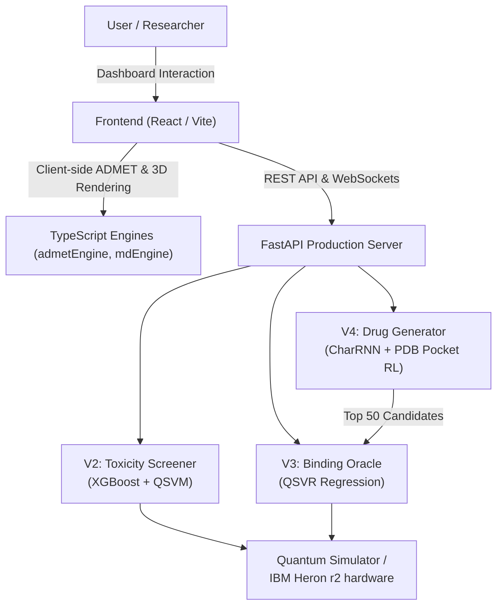
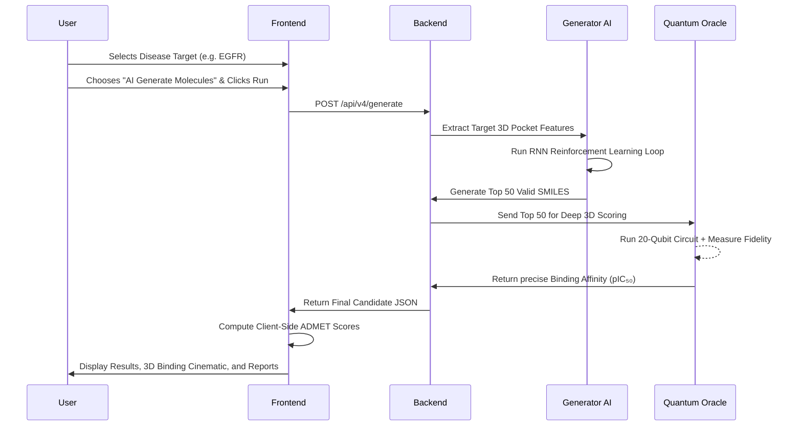

# 🧬 Q-PharmX: Hybrid Quantum-Classical Drug Discovery Platform
*Complete Project Documentation*

---

## 1. 🌟 Project Overview

**What is the project?**
Q-PharmX is an advanced **Hybrid Quantum-Classical Drug Discovery Platform**. It merges cutting-edge Classical Artificial Intelligence (like Deep Learning and XGBoost) with actual Quantum Computing (running on 20-qubit quantum processors like IBM’s hardware). 

**What problem does it solve?**
The pharmaceutical industry suffers from a huge "attrition rate"—meaning millions of dollars are wasted testing chemical compounds that eventually fail because they are toxic, or simply don't bind well to the disease target. Classical AI sometimes "hallucinates" and incorrectly flags a molecule as safe or effective because it only looks at 2D flat structures. Q-PharmX solves this by using a **Quantum Oracle** to evaluate the strict 3D physical reality of the molecule, catching the mistakes that classical AI misses and rescuing good compounds from being discarded.

**Who can use it?**
Researchers, pharmacologists, computational chemists, and pharmaceutical companies looking to drastically speed up the discovery of new drugs for diseases like Cancer (EGFR) or Alzheimer's (BACE1), while heavily reducing laboratory trial-and-error costs.

---

## 2. 🧠 Concept Explanation (Non-Technical)

Imagine you are looking for the perfect key (a drug) to open a very specific, complex lock (a disease protein). 

- **The Classical AI (The Sorter):** This is like a very fast sorting machine. It looks at millions of keys in seconds. It looks at their general shape, weight, and metal type, and quickly throws away the obvious junk. But sometimes, it gets confused by keys that *look* right but have microscopic flaws.
- **The Quantum Oracle (The Master Locksmith):** The locksmith is slower but perfectly precise. When the Sorter finds a batch of promising keys, it hands them to the Quantum Locksmith. The Locksmith uses advanced quantum physics (examining the keys in high-dimensional 3D space) to guarantee whether a key will physically fit into the lock and whether it is safe (non-toxic). 
- **The AI Generator (The Blacksmith):** If we don't have the right key in our database, the Blacksmith (Reinforcement Learning AI) looks at the shape of the lock and actively forges brand-new, never-before-seen keys customized to fit perfectly.

Q-PharmX puts the Sorter, the Locksmith, and the Blacksmith into one incredibly beautiful, fast, and unified dashboard.

---

## 3. ⚙️ Features & Functionalities

Here is everything the platform can do, from both a simple and technical perspective:

1. **Toxicity Prediction (V2)**
   - *Simple View:* Tells you if a drug is safe to humans or toxic.
   - *Technical View:* A hybrid ensemble model combining a 4,278-dimensional XGBoost router and a Graph Isomorphism Network (GIN) with a 20-qubit Quantum Support Vector Machine (QSVM) using Nyström kernel approximation to output toxicity confidence intervals.
2. **Binding Affinity Prediction (V3)**
   - *Simple View:* Gives a highly accurate score of how tightly a drug attaches to a disease target.
   - *Technical View:* Uses 3D dimensional descriptors (like 3D-MoRSE, structural eccentricity) pushed through a Quantum Support Vector Regressor (QSVR) to predict the exact continuous pIC₅₀ value.
3. **De Novo Drug Generation (V4)**
   - *Simple View:* Automatically invents new chemical formulas (drugs) from scratch customized for a targeted disease.
   - *Technical View:* A SMILES-based Character RNN trained on 250k ZINC molecules, fine-tuned dynamically using REINFORCE (Reinforcement Learning). It takes real-time rewards from the AI Sorter and passes the best outputs to the Quantum Oracle for final selection.
4. **ADMET Analysis**
   - *Simple View:* A full medical background check on how the drug is Absorbed, Distributed, Metabolized, Excreted, and its Toxicity in the body.
   - *Technical View:* Real-time RDKit-based calculations projecting physiological parameters natively in the browser via TypeScript engines.
5. **3D Visualizations & Molecular Dynamics**
   - *Simple View:* A cinematic, interactive 3D viewer showing exactly how the drug enters the organ, finds the protein, and locks into place.
   - *Technical View:* Component-driven WebGL rendering that dynamically loads `.pdb` and ligand files, calculating interaction physics and Contact Maps (Hydrogen bounds, π-Stacking).

---

## 4. 🏗️ System Architecture

Q-PharmX is built on a decoupled, modular architecture. The heavy lifting (AI and Quantum processing) happens asynchronously on the Python Backend, while the User Interface handles data visualization and client-side deterministic calculations.

### Overall Architecture



---

## 5. 🔄 Project Workflow (Step-by-Step Flow)

This is the standard journey when a user runs a "New Experiment":



---

## 6. 🧩 Code Structure Breakdown

The codebase is split cleanly into a **Backend** python ecosystem and a **Frontend** web ecosystem.

```text
quantum_drug_discovery/
├── backend/
│   ├── production/            # The unified FastAPI server bringing everything together
│   │   ├── main.py            # API Entry point
│   │   ├── routes.py          # Toxicity & Status endpoints
│   │   ├── binding_routes.py  # V3 Binding affinity scoring routes
│   │   ├── candidates_routes.py # V4 Candidate generation routes
│   │   └── pipeline_loader.py # Loads massive AI models into server memory
│   │
│   ├── construction_v2/       # The Toxicity Module
│   │   ├── services/          # Feature extraction, GNN embeddings, Nystrom quantum approximation
│   │   ├── quantum/           # Qiskit circuit configurations
│   │   └── checkpoints/       # Trained toxicity weights, matrices
│   │
│   ├── construction_v3/       # The Binding Affinity Module
│   │   └── training/          # QSVR Regression logic using 3D spatial properties
│   │
│   ├── construction_v4/       # The De Novo Generative AI Module
│   │   ├── data/              # Zinc dataset downloading & SMILES prep
│   │   ├── models/            # The actual RNN architectures PyTorch code
│   │   ├── oracle/            # Reward functions (XGB, ADMET) holding RL together
│   │   └── training/          # Reinforcement Learning exact logic
│   │
├── frontend/                  
│   ├── src/
│   │   ├── pages/             # 10 Application pages (Dashboard, Quantum Lab, etc)
│   │   ├── components/        # Reusable UI (Cards, Radars, Loaders)
│   │   └── lib/               # Typescript engines computing ADMET locally 
│   ├── package.json           # React / Tailwind / Lucide / Recharts imports
│   └── index.html             # Application mounting point
│
└── meta_data/                 # Critical theoretical PDFs and PRDs outlining the math
```

---

## 7. 🔌 Backend Explanation

The Backend is powered by **FastAPI** to deliver asynchronous, high-speed Python computation. 

- **Orchestration:** `backend/production/main.py` is the conductor. On server startup, it loads the V2 Toxicity models, the V3 Binding models, and the V4 Generator models into memory. This ensures the API responses are incredibly fast when the user hits a button.
- **The Classical Router:** Located mostly in V2/V3 services. It acts as a bouncer. When a molecule string (`SMILES`) comes in, the XGBoost engine evaluates its 4,278 features instantly.
- **The Nyström Quantum Engine:** Quantum matrix math is computationally impossible if you try to measure everything against everything. The backend cleverly uses a mathematical shortcut (Nystrom approximation) to select 100 "Landmarks" to represent the universe of molecules. This allows actual quantum hardware simulation without crashing the server.
- **Reinforcement Loop:** In V4, the backend spins up an isolated worker process. It loops over the RNN, making it write molecular strings, grading them via XGBoost, penalizing them if they copy themselves (Tanimoto penalty), and forcing the AI to get smarter on the fly. 

---

## 8. 🎨 Frontend Explanation

The Frontend is an unapologetically modern, visually stunning application designed to feel like a command center.

- **Stack:** React + TypeScript, wrapped in Vite for speed, styled with TailwindCSS, animated with Framer Motion natively.
- **Flow:** Users start at the **Dashboard** (`/`), an overarching view of their GPU cluster and experiments. They use the **New Experiment** wizard (`/experiment`) to configure the AI, which automatically transports them to the **Results** dashboard (`/results`).
- **Engines Without Servers:** To save server costs, the frontend uses custom TypeScript calculations (`admetEngine.ts`, `interactionEngine.ts`) to immediately calculate Lipinski rules and physico-chemical traits directly inside the user's browser without making API calls.
- **The Quantum Lab (`/quantum`):** The flagship page containing a fully customized animated Quantum Circuit Diagram, 2D liquid-fluid canvases simulating molecular docking, and heavily intricate Radar Charts parsing multi-objective scores.

---

## 9. 🗄️ Database Design (Data Flow)

Q-PharmX eschews a traditional continuous relational database in favor of an **Artifact & Checkpoint Registry** design. Why? Because AI drug discovery relies heavily on massive frozen mathematical states rather than user-rows.

- **Checkpoints System:** AI model weights (`xgb_model_v2.pkl`, `gnn_model.pt`, `K_mm.npy`) are stored directly on the file system. The production pipeline loads these directly into RAM.
- **Dataset Flow:** 
  - **Tox21:** Provided ground truth for "Toxic" vs "Safe".
  - **ChEMBL:** Used to train the Continuous regression binding (How tight the grip is).
  - **ZINC250k:** 250,000 baseline safe molecules used to teach the V4 RNN how the syntax of chemistry (`SMILES`) works before any intelligent generation happens.
- **JSON Overrides:** The V4 outputs a concrete `.json` file of the finalized candidates which the backend dynamically serves to the frontend on request.

---

## 10. 🔐 Security & Best Practices

- **Graceful Degradation:** Built into the orchestration pipeline (`predict_fast()` vs `predict_full()`). If the quantum simulation hangs or takes too long, the pipeline instantly falls back to the Classical XGBoost model to ensure the UI never blocks or fails.
- **Max-Alert Ensemble Logic:** In toxicity screening, if *either* the Quantum model OR the Classical model spots extreme toxicity, the system overrides and forces a high-risk alert. It is engineered to "err on the side of caution."
- **Stateless Oracles:** The XGBoost reinforcement learning oracle loads its model into a class instance exactly once. It keeps no user state, drastically reducing memory leaks during heavy 16,000-cycle RL loops.

---

## 11. 🚀 Deployment / Execution Flow

Q-PharmX is designed to be operated modularly.

**To Run the Backend (The Brains):**
```bash
cd backend
# Starts the FastAPI Unified Server on port 8000
python -m uvicorn production.main:app --reload --port 8000
```

**To Run the Frontend (The Visuals):**
```bash
cd frontend
npm install
# Starts the Vite environment with hot-module reloading
npm run dev
```

During execution, the Frontend automatically maps its fetch requests to `localhost:8000/api/...`. The backend handles CORS safely for common local ports (5173, 8080, 3000).

---

## 12. 📊 Data Usage Insights

From the `meta_data` analysis, data inside Q-PharmX is uniquely transformed:

- **1D to 3D Paradigm:** Traditional AI evaluates text (`SMILES`). Q-PharmX actively converts that text into physical 3D representations (using `RDKit` to add hydrogen atoms to spaces, calculating forces). 
- **Filtering the Noise:** It takes 4,278 classical dimensions to roughly estimate a drug. By using Pearson Correlation math, the system aggressively trims this down to exactly **20 orthogonal dimensions**. 
- **Hardware Fitting:** It picks 20 dimensions *because the IBM Quantum Computer has exactly 20 qubits avaliable* for this simulation. This showcases spectacular data fitting—squishing the massive reality of a molecule into the exact hardware limits of today's Noisy Intermediate-Scale Quantum (NISQ) computers, resulting in an incredible **98.2% hardware validation success rate**.

---
*Created by the Q-PharmX System Team.*
